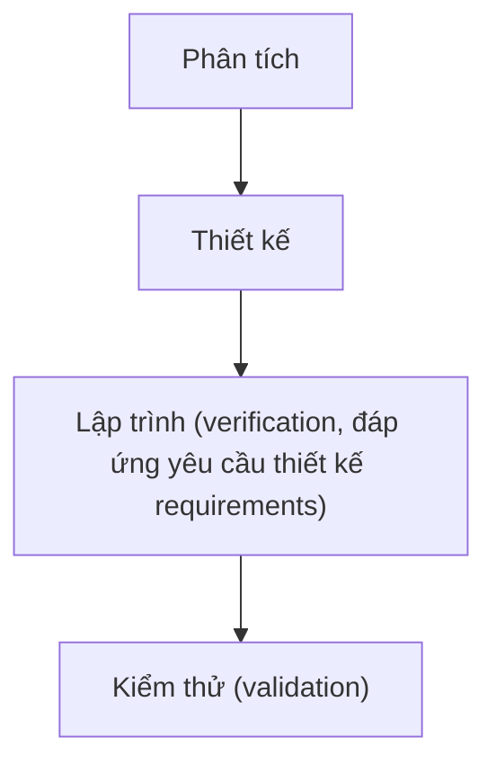
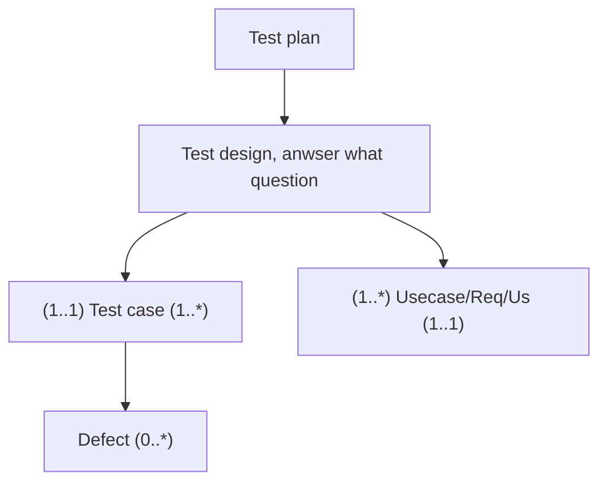

# Mục lục

<ul>
<li><a href="#software-testing">Software testing</a></li>
<li><a href="#program-testing">Program testing</a></li>
<li><a href="#flow">Flow</a></li>
</ul>

# Software testing
- Development testing
- Test-driven development
- Release testing
- User testing

# Program testing
2 khái niệm q.trọng: verification và validation.

Kiểm tra tĩnh 

# Flow

Tham khảo: bug link, bugzilla

Mỗi công đoạn làm 1 phần nào đó. Với mỗi bạn làm ít nhất 1 công đoạn ở 1 chức năng nào đó.

Cần có test report ⇒ tránh các lỗi phát sinh khi demo chương trình

Phải viết test report ⇒ báo cáo lỗi

> Written with [StackEdit](https://stackedit.io/).

