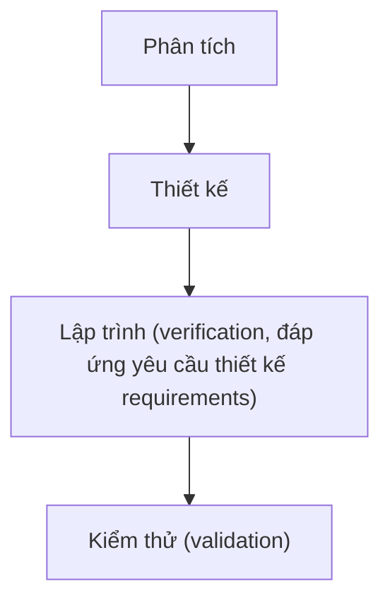
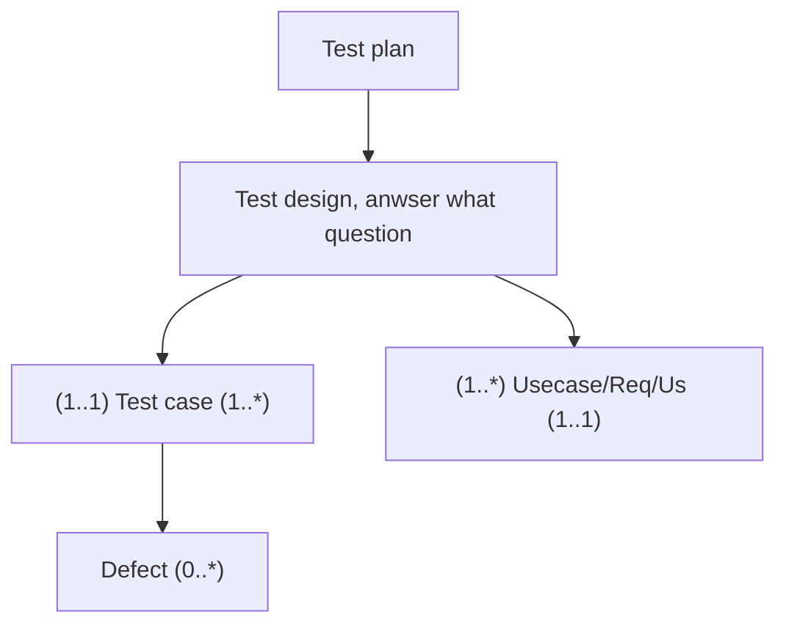

# Mục lục

<ul>
<li><a href="#software-testing">Software testing</a></li>
<li><a href="#program-testing">Program testing</a></li>
<li><a href="#flow">Flow</a></li>
<li><a href="#test-driven-development">Test driven development</a></li>
</ul>

# Software testing
- Development testing
- Test-driven development
- Release testing
- User testing

# Program testing
2 khái niệm q.trọng: verification và validation.

Kiểm tra tĩnh 

# Flow

Test design ⇒ test case ⇒ thực hiện

Tham khảo: bug link, bugzilla

Mỗi công đoạn làm 1 phần nào đó. Với mỗi bạn làm ít nhất 1 công đoạn ở 1 chức năng nào đó.

Cần có test report ⇒ tránh các lỗi phát sinh khi demo chương trình

Phải viết test report ⇒ báo cáo lỗi

Bộ test case phải đủ tốt để tìm ra lỗi. Có sửa phải test lại.

Sau khi viết test case ⇒ thực hiện thủ công || viết chương trình thực hiện tự động.

Dev viết unit test.

Chọn thủ công hay tự động dựa vào việc đánh giá. Phải có test data ⇒ mất thời gian nếu test case phức tạp.

Thêm chức năng mới ⇒ kiểm thử tự động để giảm bớt thời gian.

Chức năng không thay đổi ⇒ Viết test tự động ⇒ xác định trong test plan.

Quan trọng vẫn là test case

# Test driven development
Viết code cho sp ⇒ test coi đúng chưa ⇒ nếu chưa thì chỉnh code ⇒ thực hiện đến khi mọi thứ đã đc fix ⇒ Đi đến chức năng kế.

Xác định chức năng cần viết test ⇒ viết test ⇒ chạy test ⇒ pass thì quay lại từ đầu ⇒ fail thì cập nhật code chức năng lại và chạy lại test.

Thực tế ít công ty áp dụng cách này.

> Written at Software Technology's session

