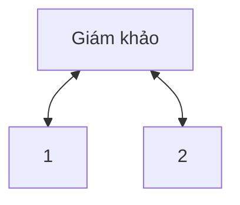

<ul>
<li><a href="#nội-dung">Nội dung</a></li>
</ul>

# Nội dung

Phép thử Turing (1950)

Khi nào máy tính gạt được giám khảo thì máy tính đó pass phép thử Turing.

Đề tài nghiên cứu
2011: IBM Question-answering <=> Jeoparody (U.S.)
Giá trị 6 tỷ USD 

Vẫn là hệ thống thông minh giả

