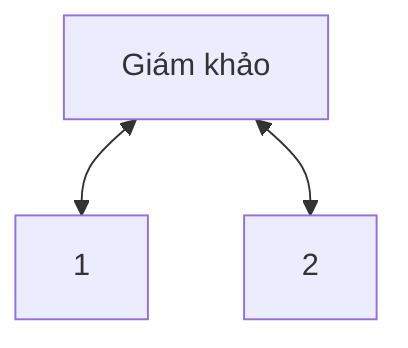
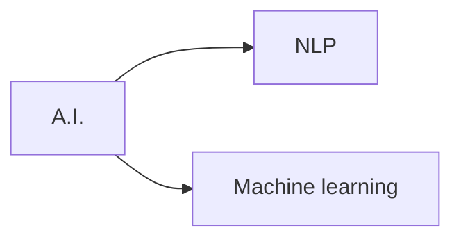
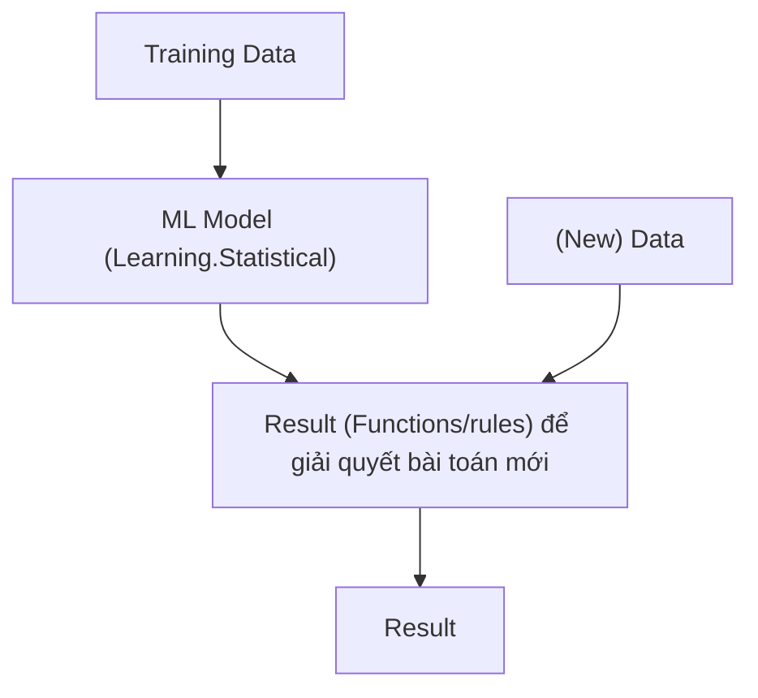
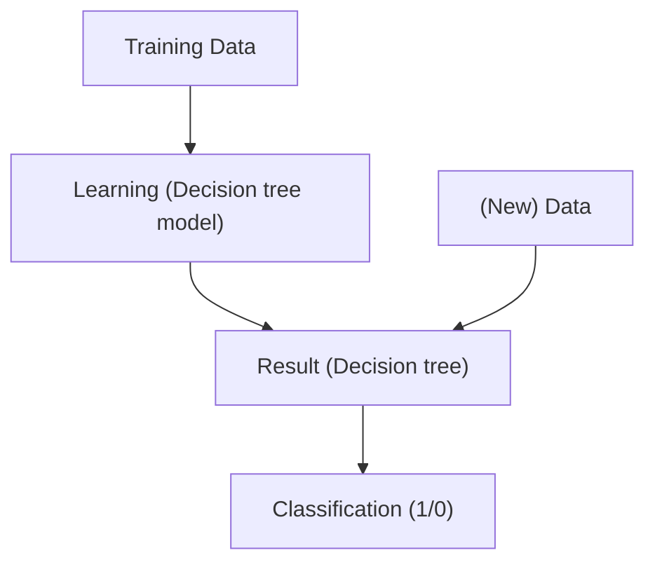

<ul>
<li><a href="#nội-dung">Nội dung</a></li>
</ul>

# Nội dung

Phép thử Turing (1950)

Khi nào máy tính gạt được giám khảo thì máy tính đó pass phép thử Turing.

Đề tài nghiên cứu
2011: IBM Question-answering <=> Jeoparody (U.S.)
Giá trị 6 tỷ USD 

Vẫn là hệ thống thông minh giả

Flow trí tuệ nhân tạo

Cây quyết định, đầu vào là bảng dữ liệu, kết quả là cây quyết định, rút ra được kết luận.

Thuật toán Quinlan (John Ross Quinlan) năm 1979

Đưa vào trainning data dạng bảng

| Mẫu | Thời tiết | Lá cây | Nhiệt độ | Quyết định (mùa) |
|--|--|--|--|--|
| 1 | Mưa | Rụng | Thấp | Đông |
| 2 | Nắng | Xanh | Trung bình | Xuân |
| 3 - 12 | ... |
|x,y,z | Mưa | Vàng | Cao | ? |

a. Từ mẫu 1 - 12, rút ra bộ luật quyết định mùa theo thuật toán Quinlan
b. Áp dụng cho mẫu x, y, z

**Chọn thuộc tính tốt (Càng nhiều vector đơn vị càng tốt)**

*CSDL ⇒ Bảng

Tập luật

