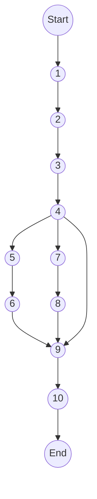
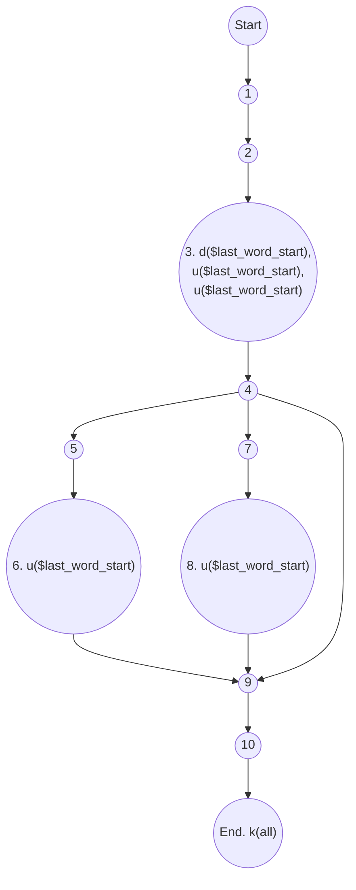
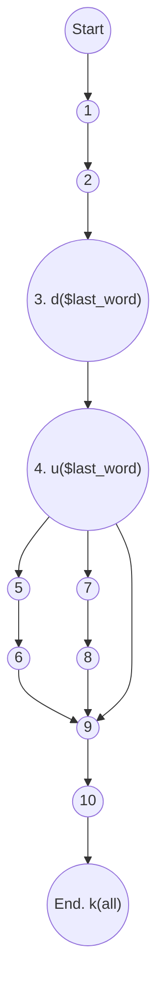
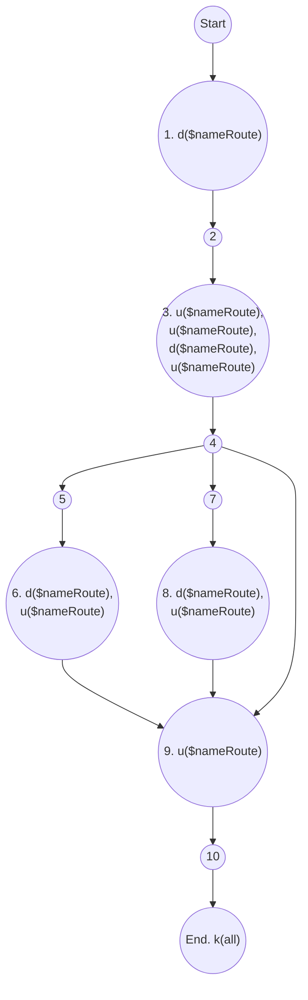

<ul>
<li><a href="#đồ-thị-luồng-điều-khiển">1. Đồ thị luồng điều khiển</a></li>
<li><a href="#độ-phức-tạp">2. Độ phức tạp</a></li>
<li><a href="#danh-sách-đường-cơ-sở">3. Danh sách đường cơ sở:</a></li>
<li><a href="#cần-2-test-case-để-100-bao-phủ-câu-lệnh">4. Cần 2 test case để 100% bao phủ câu lệnh:</a>
<ul>
<li><a href="#test-case-1">Test case 1:</a></li>
<li><a href="#test-case-2">Test case 2:</a></li>
</ul>
</li>
<li><a href="#cần-3-test-case-để-100-bao-phủ-nhánh">5. Cần 3 test case để 100% bao phủ nhánh:</a></li>
<li><a href="#cần-1-test-case-để-100-bao-phủ-quyết-định">6. Cần 1 test case để 100% bao phủ quyết định:</a></li>
<li><a href="#áp-dụng-luồng-dữ-liệu-trạng-thái-để-xác-định-các-bất-thường-của-các-biến.">7. Áp dụng luồng dữ liệu trạng thái để xác định các bất thường của các biến.</a>
<ul>
<li><a href="#xét-biến-last_word_start">Xét biến $last_word_start</a></li>
<li><a href="#xét-biến-last_word">Xét biến $last_word</a></li>
<li><a href="#xét-biến-nameroute">Xét biến $nameRoute</a></li>
</ul>
</li>
<li><a href="#xác-định-defc-use-p-use-của-các-biến-trong-chương-trình">8. Xác định def,c-use, p-use của các biến trong chương trình</a></li>
<li><a href="#kiểm-thử-luồng-dữ-liệu-bằng-phủ-all-defs-coverage---all-uses-coverage-all-du-paths-coverage">9. Kiểm thử luồng dữ liệu bằng phủ All defs-coverage,   All-uses coverage, All-Du-Paths Coverage</a>
<ul>
<li><a href="#all-defs-coverage">All defs-coverage</a></li>
<li><a href="#all-uses-coverage">All-uses coverage</a>
<ul>
<li><a href="#xét-biến-nameroute-1">Xét biến $nameRoute</a></li>
<li><a href="#xét-biến-last_word_start-1">Xét biến $last_word_start</a></li>
<li><a href="#xét-biến-last_word-1">Xét biến $last_word</a></li>
</ul>
</li>
<li><a href="#all-du-paths-coverage">All-Du-Paths Coverage</a>
<ul>
<li><a href="#xét-biến-nameroute-2">Xét biến $nameRoute</a></li>
<li><a href="#xét-biến-last_word_start-2">Xét biến $last_word_start</a></li>
<li><a href="#xét-biến-last_word-2">Xét biến $last_word</a></li>
</ul>
</li>
</ul>
</li>
<li><a href="#ktpm-requirements">KTPM requirements:</a></li>
</ul>


```php
namespace  App\Http\Services\GateService;
```

```php
// normalize name route to restful API : index,update, show, store, delete

1. static  function  getGateDefineFromRouteName(string  $nameRoute):  string
2.{
	//route admin.category.index
3.	$last_word_start =  strrpos($nameRoute,  '.'); 
	// +1 so we don't include the space in our result
	$last_word =  substr($nameRoute,  $last_word_start);  // $last_word = PHP.
	$nameRoute =  substr_replace($nameRoute,  '',  $last_word_start);

	//route admin.category
4.	switch  ($last_word)  {
5.		case  'change-status':
		case  'edit':
6.			$nameRoute =  substr_replace($nameRoute,  'update',  $last_word_start);
		break;
7.		case  'create':
8.			$nameRoute =  substr_replace($nameRoute,  'store',  $last_word_start);
		break;
	}
9.	return  $nameRoute;
10.}
```
# 1. Đồ thị luồng điều khiển


e = 11

n = 10

p = 1

# 2. Độ phức tạp
V(G) = e - n + 2P =  11 - 10 + 2 * 1 = 3

# 3. Danh sách đường cơ sở:	
- 1->2->3->4->9->10
- 1->2->3->4->5->6->9->10
- 1->2->3->4->7->8->9->10

# 4. Cần 2 test case để 100% bao phủ câu lệnh:
## Test case 1:
```php
public  function  testTestCaseOne():  void
{
	$result =  GateService::getGateDefineFromRouteName("admin.category.edit");
	$this->assertTrue($result ==  "admin.category.update");
}
```
Path
- 1->2->3->4->5->6->9->10
## Test case 2:
```php
public  function  testTestCaseTwo():  void
{
	$result =  GateService::getGateDefineFromRouteName("admin.category.create");
	$this->assertTrue($result ==  "admin.category.store");
}
```
Path
- 1->2->3->4->7->8->9->10

# 5. Cần 3 test case để 100% bao phủ nhánh:
- 1->2->3->4->5->6->9->10
- 1->2->3->4->7->8->9->10
- 1->2->3->4->9->10

# 6. Cần 1 test case để 100% bao phủ quyết định:
- 1->2->3->4->9->10

# 7. Áp dụng luồng dữ liệu trạng thái để xác định các bất thường của các biến. 


## Xét biến $last_word_start

P1: ~duuuk
P2: ~duuuk
P3: ~duuk
Cả 3 đường trên đều không chứa cặp đôi nào bất thuờng. ⇒ Không có bất thường.


## Xét biến $last_word

P1: ~duk
P2: ~duk
P3 ~duk
Cả 3 đường trên đều không chứa cặp đôi nào bất thuờng. ⇒ Không có bất thường.


## Xét biến $nameRoute

P1:  ~duududuuk
P2:  ~duududuuk
P3:  ~duuduuk
Cả 3 đường trên đều không chứa cặp đôi nào bất thuờng. ⇒ Không có bất thường.

Đoạn chương trình được đánh số sau trả lời cho câu 8:
```php
// normalize name route to restful API : index,update, show, store, delete

1. static  function  getGateDefineFromRouteName(string  $nameRoute):  string
{
	//route admin.category.index
2.	$last_word_start =  strrpos($nameRoute,  '.'); 
	// +1 so we don't include the space in our result
3.	$last_word =  substr($nameRoute,  $last_word_start);  // $last_word = PHP.
4.	$nameRoute =  substr_replace($nameRoute,  '',  $last_word_start);

	//route admin.category
5.	switch  ($last_word)  {
		case  'change-status':
		case  'edit':
6.			$nameRoute =  substr_replace($nameRoute,  'update',  $last_word_start);
		break;
		case  'create':
7.			$nameRoute =  substr_replace($nameRoute,  'store',  $last_word_start);
		break;
	}
8.	return  $nameRoute;
}
```
.
# 8. Xác định def,c-use, p-use của các biến trong chương trình
 
Dòng 1:
- def của $nameRoute: 1

Dòng 2:
- def của $last_word_start: 2
- c-use của $nameRoute: 2

Dòng 3:
- def của $last_word: 3
- c-use của $nameRoute: 3
- c-use của $last_word_start: 3

Dòng 4:
- def của $nameRoute: 4
- c-use của $nameRoute: 4
- c-use của $last_word_start: 4

Dòng 5:
- p-use của $last_word: 5

Dòng 6:
- def của $nameRoute: 6
- c-use của $nameRoute: 6
- c-use của $last_word_start: 6

Dòng 7:
- def của $nameRoute: 7
- c-use của $nameRoute: 7
- c-use của $last_word_start: 7

Dòng 8:
def của $nameRoute: 8

# 9. Kiểm thử luồng dữ liệu bằng phủ All defs-coverage,   All-uses coverage, All-Du-Paths Coverage

## All defs-coverage

Xác định các biến: $nameRoute, $last_word_start, $last_word

Xét biến $nameRoute
- Tập def của $nameRoute: {1, 3, 6, 8}
- Tập use của $nameRoute: {3, 6, 8, 9}
- Từ đỉnh 1 đến đỉnh 3 tồn tại cặp def-use (1,3).
- Path: (1,2,3,4,9,10)

Xét biến $last_word_start
- Tập def của $last_word_start: {3}
- Tập use của $last_word_start: {3, 6, 8}
- Từ đỉnh 3 đến đỉnh 6 tồn tại cặp def-use (3, 6).
- Path: (1,2,3,4,5,6,9,10)

Xét biến $last_word
- Tập def của $last_word: {3}
- Tập use của $last_word: {4}
- Từ đỉnh 3 đến đỉnh 4 tồn tại cặp def-use (3, 4)
- Path: (1,2,3,4,9,10)

⇒ Thoả điều kiện All defs-coverage

## All-uses coverage

### Xét biến $nameRoute
- Từ d1($ nameRoute) đến u3($ nameRoute)
- Từ d3($ nameRoute) đến u3($ nameRoute)
- Từ d6($ nameRoute) đến u6($ nameRoute)
- Từ d8($ nameRoute) đến u8($ nameRoute)
- Từ d3($ nameRoute) đến u9($ nameRoute)
- Từ d6($ nameRoute) đến u9($ nameRoute)
- Từ d8($ nameRoute) đến u9($ nameRoute)

Cặp def use và def clear path của biến này:
- (1,3): [1,3]
- (3,3): [3]
- (6,6): [6]
- (8,8): [8]
- (3,9): [3,4,9]
- (6,9): [6,9]
- (8,9): [8,9]

### Xét biến $last_word_start
- Từ d3($ last_word_start) đến u3($ last_word_start)
- Từ d3($ last_word_start) đến u6($ last_word_start)
- Từ d3($ last_word_start) đến u8($ last_word_start)

Cặp def use và def clear path của biến này:
-	(3,3): [3]
-	(3,6): [3,4,5,6]
-	(3,8): [3,4,7,8]

### Xét biến $last_word
- Từ d3($ last_word) đến u4($ last_word)

Cặp def use và def clear path của biến này:
- (3,4): [3,4]

⇒ Path của cả 3 biến:
- [1,2,3,4,5,6,9,10]
- [1,2,3,4,7,8,9,10]
- [1,2,3,4,9,10]

⇒ Thoả điều kiện All-uses coverage

## All-Du-Paths Coverage

### Xét biến $nameRoute
- Tất cả d1($ nameRoute) đến u3($ nameRoute): [1,2,3]
- Tất cả d3($ nameRoute) đến u3($ nameRoute): [3]
- Tất cả d6($ nameRoute) đến u6($ nameRoute): [6]
- Tất cả d8($ nameRoute) đến u8($ nameRoute): [8]
- Tất cả d3($ nameRoute) đến u9($ nameRoute): [3,4,9]
- Tất cả d6($ nameRoute) đến u9($ nameRoute): [6,9]
- Tất cả d8($ nameRoute) đến u9($ nameRoute): [8,9]

Các đường dẫn thoả yêu cầu:
- [1,2,3,4,5,6,9,10]
- [1,2,3,4,7,8,9,10]
- [1,2,3,4,9,10]

### Xét biến $last_word_start

- Từ d3($ last_word_start) đến u3($ last_word_start): [3]
- Từ d3($ last_word_start) đến u6($ last_word_start): [3,4,5,6]
- Từ d3($ last_word_start) đến u8($ last_word_start): [3,4,7,8]

Các đường dẫn thoả yêu cầu
- [1,2,3,4,5,6,9,10]
- [1,2,3,4,7,8,9,10]

### Xét biến $last_word
- Từ d3($ last_word) đến u4($ last_word)

Các đường dẫn thoả yêu cầu:
- [1,2,3,4,5,6,9,10]
- [1,2,3,4,7,8,9,10]
- [1,2,3,4,9,10]

⇒ Thoả điều kiện All-Du-Paths Coverage

# KTPM requirements: 
1. Vẽ đồ thị luồng điều khiển.  
2. Tính độ phức tạp Cyclomatic của đồ thị.  
3. Xác định tập các đường cơ sở.  
4. Cần bao nhiêu test để 100% bao phủ câu lệnh  
(Statement coverage - SC). Xác định các đường dẫn tương ứng.  
5. Cần bao nhiêu test đối với 100% bao phủ bao phủ nhánh (Branch coverage - BC). Xác định các đường dẫn tương ứng.  
6. Cần bao nhiêu test đối với 100% bao phủ bao phủ quyết định (Decision coverage - DC). Xác định các đường dẫn tương ứng  
7. Áp dụng luồng dữ liệu trạng thái để xác định các bất thường của  
các biến.   
8. Xác định def,c-use, p-use của các biến trong chương trình    
9. Kiểm thử luồng dữ liệu bằng phủ All defs-coverage,  
All-uses coverage, All- Du- Paths Coverage

> Written with [StackEdit](https://stackedit.io/).

