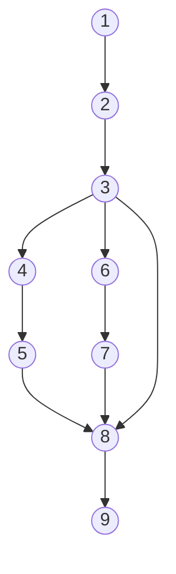

```php
namespace  App\Http\Services\GateService;
```

```php
// normalize name route to restful API : index,update, show, store, delete

static  function  getGateDefineFromRouteName(string  $nameRoute):  string
1.{
	//route admin.category.index
2.	$last_word_start =  strrpos($nameRoute,  '.'); 
	// +1 so we don't include the space in our result
	$last_word =  substr($nameRoute,  $last_word_start);  // $last_word = PHP.
	$nameRoute =  substr_replace($nameRoute,  '',  $last_word_start);

	//route admin.category
3.	switch  ($last_word)  {
4.		case  'change-status':
		case  'edit':
5.			$nameRoute =  substr_replace($nameRoute,  'update',  $last_word_start);
		break;
6.		case  'create':
7.			$nameRoute =  substr_replace($nameRoute,  'store',  $last_word_start);
		break;
	}
8.	return  $nameRoute;
9.}
```
1. Đồ thị luồng điều khiển

e = 10
n = 9
p = 1

2. Độ phức tạp: V(G) = e - n + 2P =  10 - 9 + 2 * 1 = 3
3. Danh sách đường cơ sở:	
	- 1->2->3->4->5->8->9
	- 1->2->3->6->7->8->9
	- 1->2->3->8->9
4. Cần 2 test case để 100% bao phủ câu lệnh:
	- 1->2->3->4->5->8->9
	- 1->2->3->6->7->8->9
5. Cần 3 test case để 100% bao phủ nhánh:
	- 1->2->3->4->5->8->9
	- 1->2->3->6->7->8->9
	- 1->2->3->8->9
6. Cần 3 test case để 100% bao phủ quyết định:
	- 1->2->3->4->5->8->9
	- 1->2->3->6->7->8->9
	- 1->2->3->8->9
7.
8.
9.

KTPM requirements: 
1. Vẽ đồ thị luồng điều khiển.  
2. Tính độ phức tạp Cyclomatic của đồ thị.  
3. Xác định tập các đường cơ sở.  
4. Cần bao nhiêu test để 100% bao phủ câu lệnh  
(Statement coverage - SC). Xác định các đường dẫn tương ứng.  
5. Cần bao nhiêu test đối với 100% bao phủ bao phủ nhánh (Branch coverage - BC). Xác định các đường dẫn tương ứng.  
6. Cần bao nhiêu test đối với 100% bao phủ bao phủ quyết định (Decision coverage - DC). Xác định các đường dẫn tương ứng  
7. Áp dụng luồng dữ liệu trạng thái để xác định các bất thường của  
các biến.   
8. Xác định def,c-use, p-use của các biến trong chương trình    
9. Kiểm thử luồng dữ liệu bằng phủ All defs-coverage,  
All-uses coverage, All- Du- Paths Coverage

> Written with [StackEdit](https://stackedit.io/).

