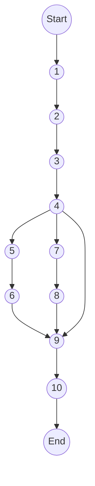
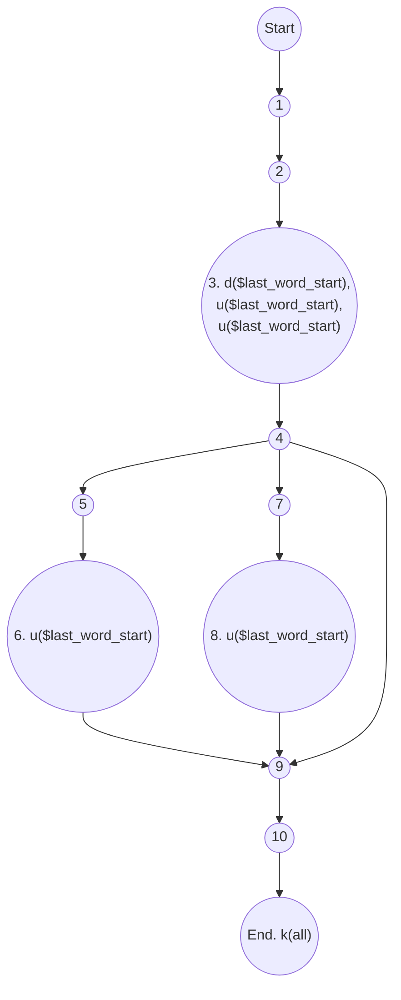
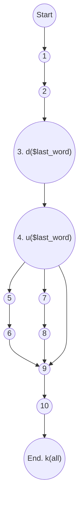
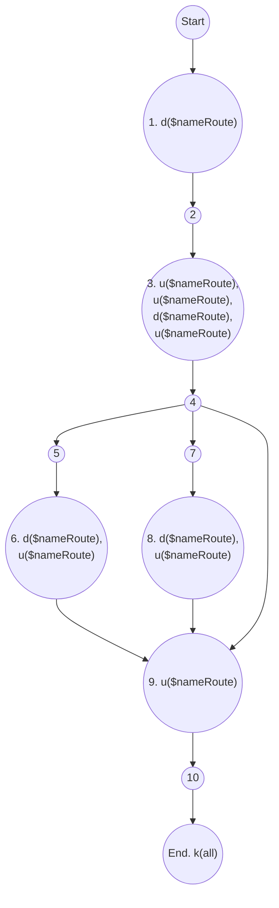

```php
namespace  App\Http\Services\GateService;
```

```php
// normalize name route to restful API : index,update, show, store, delete

1. static  function  getGateDefineFromRouteName(string  $nameRoute):  string
2.{
	//route admin.category.index
3.	$last_word_start =  strrpos($nameRoute,  '.'); 
	// +1 so we don't include the space in our result
	$last_word =  substr($nameRoute,  $last_word_start);  // $last_word = PHP.
	$nameRoute =  substr_replace($nameRoute,  '',  $last_word_start);

	//route admin.category
4.	switch  ($last_word)  {
5.		case  'change-status':
		case  'edit':
6.			$nameRoute =  substr_replace($nameRoute,  'update',  $last_word_start);
		break;
7.		case  'create':
8.			$nameRoute =  substr_replace($nameRoute,  'store',  $last_word_start);
		break;
	}
9.	return  $nameRoute;
10.}
```
1. Đồ thị luồng điều khiển

e = 11
n = 10
p = 1

2. Độ phức tạp: V(G) = e - n + 2P =  11 - 10 + 2 * 1 = 3
3. Danh sách đường cơ sở:	
	- 1->2->3->4->5->6->9->10
	- 1->2->3->4->7->8->9->10
	- 1->2->3->4->9->10
4. Cần 2 test case để 100% bao phủ câu lệnh:
	- 1->2->3->4->5->6->9->10
	- 1->2->3->4->7->8->9->10
5. Cần 3 test case để 100% bao phủ nhánh:
	- 1->2->3->4->5->6->9->10
	- 1->2->3->4->7->8->9->10
	- 1->2->3->4->9->10
6. Cần 3 test case để 100% bao phủ quyết định:
	- 1->2->3->4->5->6->9->10
	- 1->2->3->4->7->8->9->10
	- 1->2->3->4->9->10
7. Áp dụng luồng dữ liệu trạng thái để xác định các bất thường của các biến. 


> Xét biến $last_word_start



P1: ~duuuk
P2: ~duuuk
P3: ~duuk
Cả 3 đường trên đều không chứa cặp đôi nào bất thuờng. ⇒ Không có bất thường.


> Xét biến $last_word



P1: ~duk
P2: ~duk
P3 ~duk
Cả 3 đường trên đều không chứa cặp đôi nào bất thuờng. ⇒ Không có bất thường.


> Xét biến $nameRoute



P1:  ~duududuuk
P2:  ~duududuuk
P3:  ~duuduuk
Cả 3 đường trên đều không chứa cặp đôi nào bất thuờng. ⇒ Không có bất thường.

Đoạn chương trình được đánh số sau trả lời cho câu 8:
```php
// normalize name route to restful API : index,update, show, store, delete

1. static  function  getGateDefineFromRouteName(string  $nameRoute):  string
{
	//route admin.category.index
2.	$last_word_start =  strrpos($nameRoute,  '.'); 
	// +1 so we don't include the space in our result
3.	$last_word =  substr($nameRoute,  $last_word_start);  // $last_word = PHP.
4.	$nameRoute =  substr_replace($nameRoute,  '',  $last_word_start);

	//route admin.category
5.	switch  ($last_word)  {
		case  'change-status':
		case  'edit':
6.			$nameRoute =  substr_replace($nameRoute,  'update',  $last_word_start);
		break;
		case  'create':
7.			$nameRoute =  substr_replace($nameRoute,  'store',  $last_word_start);
		break;
	}
8.	return  $nameRoute;
}
```
.
9. Xác định def,c-use, p-use của các biến trong chương trình
 
Dòng 1:
- def của $nameRoute: 1

Dòng 2:
- def của $last_word_start: 2
- c-use của $nameRoute: 2

Dòng 3:
- def của $last_word: 3
- c-use của $nameRoute: 3
- c-use của $last_word_start: 3

Dòng 4:
- def của $nameRoute: 4
- c-use của $nameRoute: 4
- c-use của $last_word_start: 4

Dòng 5:
- p-use của $last_word: 5

Dòng 6:
- def của $nameRoute: 6
- c-use của $nameRoute: 6
- c-use của $last_word_start: 6

Dòng 7:
- def của $nameRoute: 7
- c-use của $nameRoute: 7
- c-use của $last_word_start: 7

Dòng 8:
def của $nameRoute: 8

9. Kiểm thử luồng dữ liệu bằng phủ All defs-coverage,  
All-uses coverage, All- Du- Paths Coverage
- All defs-coverage

Xác định các biến: $nameRoute, $last_word_start, $last_word 

$nameRoute
- Tập def của $nameRoute: {1, 3, 6, 8}
- Tập use của $nameRoute: {3, 6, 8, 9}
- Từ đỉnh 1 đến đỉnh 3 tồn tại cặp def-use (1,3).
- Path: (1,2,3,4,9,10)

$last_word_start
- Tập def của $last_word_start: {3}
- Tập use của $last_word_start: {3, 6, 8}
- Từ đỉnh 3 đến đỉnh 6 tồn tại cặp def-use (3, 6).
- Path: (1,2,3,4,5,6,9,10)

$last_word
- Tập def của $last_word: {3}
- Tập use của $last_word: {4}
- Từ đỉnh 3 đến đỉnh 4 tồn tại cặp def-use (3, 4)
- Path: (1,2,3,4,9,10)

KTPM requirements: 
1. Vẽ đồ thị luồng điều khiển.  
2. Tính độ phức tạp Cyclomatic của đồ thị.  
3. Xác định tập các đường cơ sở.  
4. Cần bao nhiêu test để 100% bao phủ câu lệnh  
(Statement coverage - SC). Xác định các đường dẫn tương ứng.  
5. Cần bao nhiêu test đối với 100% bao phủ bao phủ nhánh (Branch coverage - BC). Xác định các đường dẫn tương ứng.  
6. Cần bao nhiêu test đối với 100% bao phủ bao phủ quyết định (Decision coverage - DC). Xác định các đường dẫn tương ứng  
7. Áp dụng luồng dữ liệu trạng thái để xác định các bất thường của  
các biến.   
8. Xác định def,c-use, p-use của các biến trong chương trình    
9. Kiểm thử luồng dữ liệu bằng phủ All defs-coverage,  
All-uses coverage, All- Du- Paths Coverage

> Written with [StackEdit](https://stackedit.io/).

