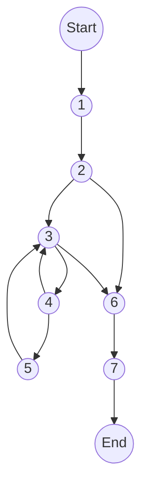
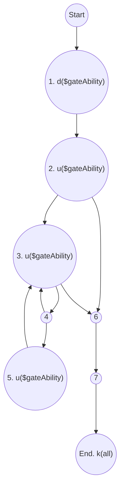
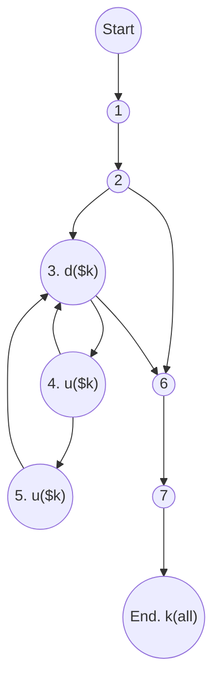
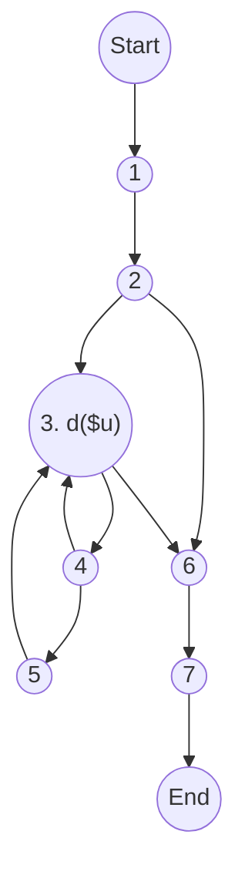

<ul>
<li><a href="#đồ-thị-luồng-điều-khiển">1. Đồ thị luồng điều khiển:</a></li>
<li><a href="#độ-phức-tạp">2. Độ phức tạp:</a></li>
<li><a href="#danh-sách-đường-cơ-sở">3. Danh sách đường cơ sở:</a></li>
<li><a href="#cần-1-test-case-để-100-bao-phủ-câu-lệnh">4. Cần 1 test case để 100% bao phủ câu lệnh:</a></li>
<li><a href="#cần-3-test-case-để-100-bao-phủ-nhánh">5. Cần 3 test case để 100% bao phủ nhánh:</a></li>
<li><a href="#cần-1-test-case-để-100-bao-phủ-quyết-định">6. Cần 1 test case để 100% bao phủ quyết định:</a></li>
<li><a href="#áp-dụng-luồng-dữ-liệu-trạng-thái-để-xác-định-các-bất-thường-của-các-biến.">7. Áp dụng luồng dữ liệu trạng thái để xác định các bất thường của các biến.</a>
<ul>
<li><a href="#xét-biến-gateability">Xét biến $gateAbility</a></li>
<li><a href="#xét-biến-k">Xét biến $k</a></li>
<li><a href="#xét-biến-v">Xét biến $v</a></li>
</ul>
</li>
<li><a href="#xác-định-defc-use-p-use-của-các-biến-trong-chương-trình">8. Xác định def,c-use, p-use của các biến trong chương trình</a></li>
<li><a href="#kiểm-thử-luồng-dữ-liệu-bằng-phủ-all-defs-coverage-all-uses-coverage-all-du-paths-coverage">9. Kiểm thử luồng dữ liệu bằng phủ All defs-coverage, All-uses coverage, All-Du-Paths Coverage</a></li>
<li><a href="#ktpm-requirements">KTPM requirements:</a></li>
</ul>


```php
namespace  App\Http\Services\GateService;
```
```php
// chỉ lấy những quyền của admin
1. static  function  getAdminAbility($gateAbility):  array
 {
	// quy ước tên quyền
	// <role>.<tên quyền>.<hành động>
	// admin.category.index
	// user.category.index
2.	if(is_array($gateAbility))
	{
3.		foreach($gateAbility as  $k=>$v )
		{
			//xoá những quyền không chứa "admin"
4.			if(!str_contains($k,'admin')){
5.				unset($gateAbility[$k]);
			}
		}
	}
6.	return  [];
7.}
```
# 1. Đồ thị luồng điều khiển:


e = 9

n = 7

p = 1

# 2. Độ phức tạp: 
V(G) = e - n + 2P =  9 - 7 + 2 * 1 = 4
# 3. Danh sách đường cơ sở:
- 1->2->6->7
- 1->2->3->6->7
- 1->2->3->4->3->6->7
- 1->2->3->4->5->3->6->7
# 4. Cần 1 test case để 100% bao phủ câu lệnh:
- 1->2->3->4->5->3->6->7
# 5. Cần 3 test case để 100% bao phủ nhánh:
- 1->2->6->7
- 1->2->3->4->3->6->7
- 1->2->3->4->5->3->6->7
# 6. Cần 1 test case để 100% bao phủ quyết định:
1->2->3->4->5->3->6->7
# 7. Áp dụng luồng dữ liệu trạng thái để xác định các bất thường của các biến.  

## Xét biến $gateAbility

P1: ~duk
P2: ~duuk
P3: ~duuuk

Cả 3 đường trên đều không chứa cặp đôi nào bất thường. ⇒ Không có bất thường

## Xét biến $k

P1: ~du**dk**
P2: ~duu**dk**

Chứa cặp đôi bất thường ⇒ Có bất thường

## Xét biến $v

P1: ~**dk**

Chứa cặp đôi bất thường ⇒ Có bất thường

# 8. Xác định def,c-use, p-use của các biến trong chương trình
# 9. Kiểm thử luồng dữ liệu bằng phủ All defs-coverage, All-uses coverage, All-Du-Paths Coverage

# KTPM requirements: 
1. Vẽ đồ thị luồng điều khiển.  
2. Tính độ phức tạp Cyclomatic của đồ thị.  
3. Xác định tập các đường cơ sở.  
4. Cần bao nhiêu test để 100% bao phủ câu lệnh  
(Statement coverage - SC). Xác định các đường dẫn tương ứng.  
5. Cần bao nhiêu test đối với 100% bao phủ bao phủ nhánh (Branch coverage - BC). Xác định các đường dẫn tương ứng.  
6. Cần bao nhiêu test đối với 100% bao phủ bao phủ quyết định (Decision coverage - DC). Xác định các đường dẫn tương ứng  
7. Áp dụng luồng dữ liệu trạng thái để xác định các bất thường của các biến.
8. Xác định def,c-use, p-use của các biến trong chương trình    
9. Kiểm thử luồng dữ liệu bằng phủ All defs-coverage, All-uses coverage, All- Du- Paths Coverage.

> Written with [StackEdit](https://stackedit.io/).

