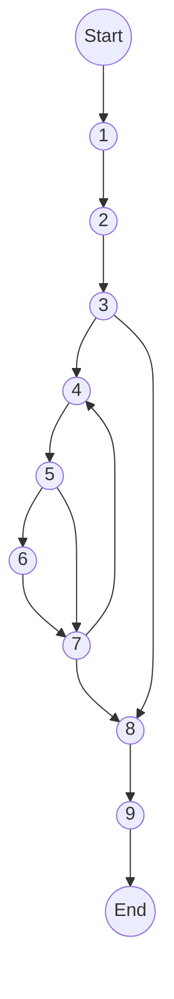

<ul>
<li><a href="#ktpm-requirements">KTPM requirements:</a></li>
</ul>


```php
namespace  App\Http\Services\GateService;
```
```php
// chỉ lấy những quyền của admin
1. static  function  getAdminAbility($gateAbility):  array
2. {
	// quy ước tên quyền
	// <role>.<tên quyền>.<hành động>
	// admin.category.index
	// user.category.index
3.	if(is_array($gateAbility))
	{
4.		foreach($gateAbility as  $k=>$v )
		{
			//xoá những quyền không chứa "admin"
5.			if(!str_contains($k,'admin')){
6.				unset($gateAbility[$k]);
			}
7.		}
	}
8.	return  [];
9.}
```
1. Đồ thị luồng điều khiển:


e = 11

n = 9

p = 1

2. Độ phức tạp: V(G) = e - n + 2P =  11 - 9 + 2 * 1 = 4
3. Danh sách đường cơ sở:
- 1->2->3->8->9
- 1->2->3->4->5->6->7->8->9
- 1->2->3->4->5->7->8->9


# KTPM requirements: 
1. Vẽ đồ thị luồng điều khiển.  
2. Tính độ phức tạp Cyclomatic của đồ thị.  
3. Xác định tập các đường cơ sở.  
4. Cần bao nhiêu test để 100% bao phủ câu lệnh  
(Statement coverage - SC). Xác định các đường dẫn tương ứng.  
5. Cần bao nhiêu test đối với 100% bao phủ bao phủ nhánh (Branch coverage - BC). Xác định các đường dẫn tương ứng.  
6. Cần bao nhiêu test đối với 100% bao phủ bao phủ quyết định (Decision coverage - DC). Xác định các đường dẫn tương ứng  
7. Áp dụng luồng dữ liệu trạng thái để xác định các bất thường của  
các biến.   
8. Xác định def,c-use, p-use của các biến trong chương trình    
9. Kiểm thử luồng dữ liệu bằng phủ All defs-coverage,  
All-uses coverage, All- Du- Paths Coverage

> Written with [StackEdit](https://stackedit.io/).

