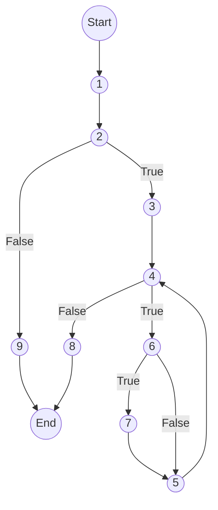
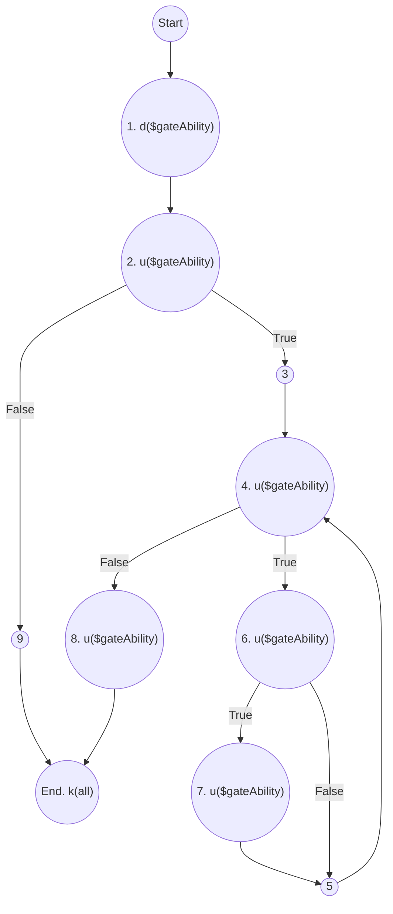
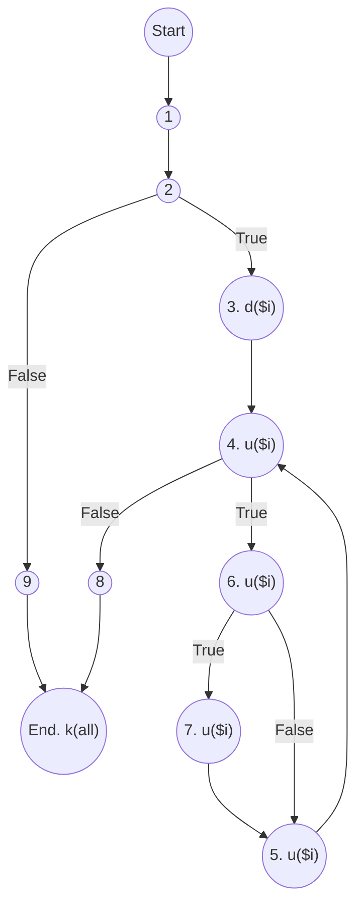

<ul>
<li><a href="#đồ-thị-luồng-điều-khiển">1. Đồ thị luồng điều khiển:</a></li>
<li><a href="#độ-phức-tạp">2. Độ phức tạp:</a></li>
<li><a href="#danh-sách-đường-cơ-sở">3. Danh sách đường cơ sở:</a></li>
<li><a href="#cần-2-test-case-để-100-bao-phủ-câu-lệnh">4. Cần 2 test case để 100% bao phủ câu lệnh:</a></li>
<li><a href="#cần-3-test-case-để-100-bao-phủ-nhánh">5. Cần 3 test case để 100% bao phủ nhánh:</a></li>
<li><a href="#cần-3-test-case-để-100-bao-phủ-quyết-định">6. Cần 3 test case để 100% bao phủ quyết định:</a></li>
<li><a href="#áp-dụng-luồng-dữ-liệu-trạng-thái-để-xác-định-các-bất-thường-của-các-biến.">7. Áp dụng luồng dữ liệu trạng thái để xác định các bất thường của các biến.</a>
<ul>
<li><a href="#xét-biến-gateability">Xét biến $gateAbility</a></li>
<li><a href="#xét-biến-i">Xét biến $i</a></li>
</ul>
</li>
<li><a href="#xác-định-defc-use-p-use-của-các-biến-trong-chương-trình">8. Xác định def,c-use, p-use của các biến trong chương trình</a></li>
<li><a href="#kiểm-thử-luồng-dữ-liệu-bằng-phủ-all-defs-coverage-all-uses-coverage-all-du-paths-coverage">9. Kiểm thử luồng dữ liệu bằng phủ All defs-coverage, All-uses coverage, All-Du-Paths Coverage</a>
<ul>
<li><a href="#all-defs-coverage">All defs-coverage</a></li>
<li><a href="#all-uses-coverage">All-uses coverage</a>
<ul>
<li><a href="#xét-biến-gateability-1">Xét biến $gateAbility</a></li>
<li><a href="#xét-biến-k">Xét biến $k</a></li>
<li><a href="#xét-biến-v">Xét biến $v</a></li>
</ul>
</li>
<li><a href="#all-du-paths-coverage">All-Du-Paths Coverage</a>
<ul>
<li><a href="#xét-biến-gateability-2">Xét biến $gateAbility</a></li>
<li><a href="#xét-biến-k-1">Xét biến $k</a></li>
<li><a href="#xét-biến-v-1">Xét biến $v</a></li>
</ul>
</li>
</ul>
</li>
<li><a href="#ktpm-requirements">KTPM requirements:</a></li>
</ul>


```php
namespace  App\Http\Services\GateService;
```
```php
// chỉ lấy những quyền của admin
1. static  function  getAdminAbility($gateAbility):  array
 {
	// quy ước tên quyền
	// <role>.<tên quyền>.<hành động>
	// admin.category.index
	// user.category.index
2.	if(is_array($gateAbility))
	{
3.		for($i = 0;
4.	'	$i < count($gateAbility);
5.  	$i++) {
6.			if (!str_contains(array_keys($gateAbility)[$i], "admin"))
7.				unset($gateAbility[$i]);
		}
8.		return $gateAbility;
	}
9.	return  [];
}
```
# 1. Đồ thị luồng điều khiển:


e = 10

n = 9

p = 2

# 2. Độ phức tạp: 
V(G) = e - n + 2P =  10 - 9 + 2 * 2 = 4

# 3. Danh sách đường cơ sở:
- 1->2->9
- 1->2->3->4->8
- 1->2->3->4->6->7->5->4->8
- 1->2->3->4->6->5->4->8

# 4. Cần 2 test case để 100% bao phủ câu lệnh:
Test case 1:
- 1->2->9

Test case 2:
- 1->2->3->4->6->7->5->4->8

# 5. Cần 3 test case để 100% bao phủ nhánh:
- 1->2->9
- 1->2->3->4->6->7->5->4->8
- 1->2->3->4->6->5->4->8

# 6. Cần 3 test case để 100% bao phủ quyết định:
- 1->2->9
- 1->2->3->4->6->7->5->4->8
- 1->2->3->4->6->5->4->8

# 7. Áp dụng luồng dữ liệu trạng thái để xác định các bất thường của các biến.  

## Xét biến $gateAbility

P1: ~duk
P2: ~duuuk
P3: ~duuuuuk

Cả 3 đường trên đều không chứa cặp đôi nào bất thường. ⇒ Không có bất thường

## Xét biến $i

P1: ~duuuuk
P2: ~duuuuuk

Cả 2 đường trên đều không chứa cặp đôi nào bất thường. ⇒ Không có bất thường

# 8. Xác định def,c-use, p-use của các biến trong chương trình

Dòng 1:
- def của $gateAbility

Dòng 2:
- p-use của $gateAbility

Dòng 3:
- def của $i

Dòng 4:
- p-use của $i
- p-use của $gateAbility

Dòng 5:
- c-use của $i

Dòng 6:
- c-use của $i
- c-use của $gateAbility

Dòng 7:
- c-use của $i
- c-use của $gateAbility

Dòng 8:
- c-use của $gateAbility

# 9. Kiểm thử luồng dữ liệu bằng phủ All defs-coverage, All-uses coverage, All-Du-Paths Coverage

## All defs-coverage

Xác định các biến: $gateAbility, $i

Xét biến $gateAbility:
- Tập def của $gateAbility: {1}
- Tập use của $gateAbility: {2,3,5,6}
- Từ đỉnh 1 đến đỉnh 2 tồn tại cặp def-use (1,2)
- Path: [1,2,6,7]

Xét biến $k:
- Tập def của $k: {3}
- Tập use của $k: {4, 5}
- Từ đỉnh 3 đến đỉnh 4 tồn tại cặp def-use (3,4)
- Path: [1,2,3,4,3,6,7]

Xét biến $v:
- Tập def của $v: {3}
- Tập use của $v: {}
- Không tồn tại cặp def-use nào.

⇒ Không thoả điều kiện của all defs-coverage

## All-uses coverage

### Xét biến $gateAbility
- Từ d1($ gateAbility) đến u2($ gateAbility)
- Từ d1($ gateAbility) đến u3($ gateAbility)
- Từ d1($ gateAbility) đến u5($ gateAbility)
- Từ d1($ gateAbility) đến u6($ gateAbility)

Cặp def use và def clear path của biến này:
- (1,2): [1,2]
- (1,3): [1,2,3]
- (1,5): [1,2,3,4,5]
- (1,6): [1,2,3,6]

### Xét biến $k
- Từ d3($ gateAbility) đến u4($ gateAbility)
- Từ d3($ gateAbility) đến u5($ gateAbility)

Cặp def use và def clear path của biến này:
- (3,4): [3,4]
- (3,5): [3,4,5]

### Xét biến $v
- Không tồn tại cặp def-use nào.

⇒ Không thoả điều kiện All-uses coverage

## All-Du-Paths Coverage

### Xét biến $gateAbility
- Tất cả d1($ gateAbility) đến u2($ gateAbility): [1,2]
- Tất cả d1($ gateAbility) đến u3($ gateAbility): [1,2,3]
- Tất cả d1($ gateAbility) đến u5($ gateAbility): [1,2,3,4,5]
- Tất cả d1($ gateAbility) đến u6($ gateAbility): [1,2,3,4,5,3,6], [1,2,3,6], [1,2,3,4,3,6]

Các đường dẫn thoả yêu cầu:
- [1,2,7,8]
- [1,2,3,6,8]
- [1,2,3,4,3,6,8]
- [1,2,3,4,5,3,6,8]

### Xét biến $k
- Từ d3($ gateAbility) đến u4($ gateAbility)
- Từ d3($ gateAbility) đến u5($ gateAbility)

Các đường dẫn thoả yêu cầu:
- [1,2,3,4,3,6,8]
- [1,2,3,4,5,3,6,8]

### Xét biến $v
- Không tồn tại cặp def-use nào.

⇒ Không thoả điều kiện All-Du-Paths Coverage

# KTPM requirements: 
1. Vẽ đồ thị luồng điều khiển.  
2. Tính độ phức tạp Cyclomatic của đồ thị.  
3. Xác định tập các đường cơ sở.  
4. Cần bao nhiêu test để 100% bao phủ câu lệnh  
(Statement coverage - SC). Xác định các đường dẫn tương ứng.  
5. Cần bao nhiêu test đối với 100% bao phủ bao phủ nhánh (Branch coverage - BC). Xác định các đường dẫn tương ứng.  
6. Cần bao nhiêu test đối với 100% bao phủ bao phủ quyết định (Decision coverage - DC). Xác định các đường dẫn tương ứng  
7. Áp dụng luồng dữ liệu trạng thái để xác định các bất thường của các biến.
8. Xác định def,c-use, p-use của các biến trong chương trình    
9. Kiểm thử luồng dữ liệu bằng phủ All defs-coverage, All-uses coverage, All- Du- Paths Coverage.

> Written with [StackEdit](https://stackedit.io/).

