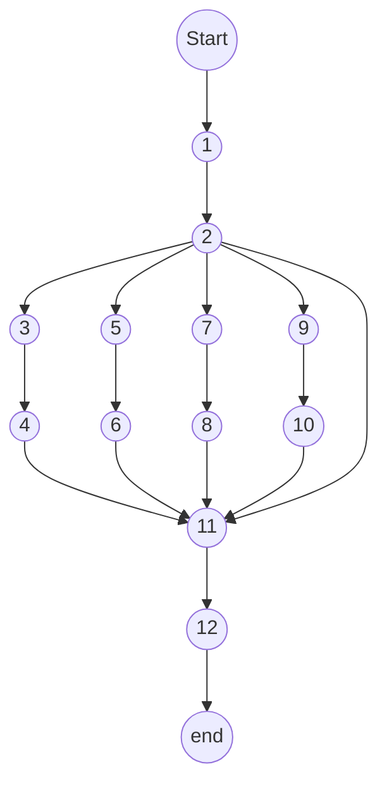
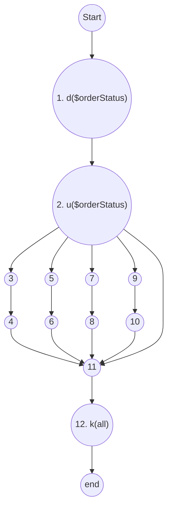
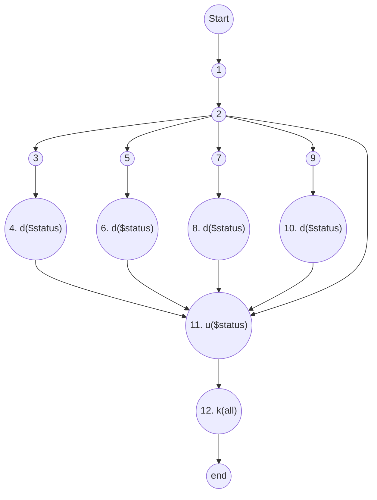
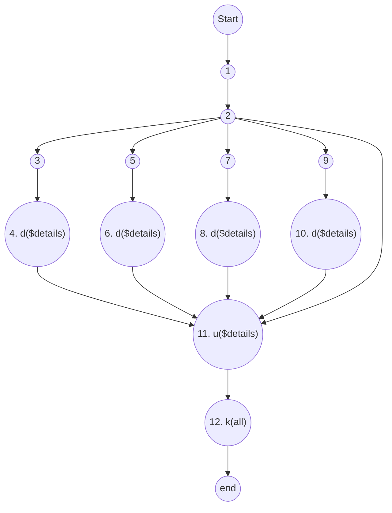

<ul>
<li><a href="#vẽ-đồ-thị-luồng-điều-khiển.">1. Vẽ đồ thị luồng điều khiển.</a></li>
<li><a href="#tính-độ-phức-tạp-cyclomatic-của-đồ-thị.">2. Tính độ phức tạp Cyclomatic của đồ thị.</a></li>
<li><a href="#xác-định-tập-các-đường-cơ-sở.">3. Xác định tập các đường cơ sở.</a></li>
<li><a href="#cần-bao-nhiêu-test-để-100-bao-phủ-câu-lệnh">4. Cần bao nhiêu test để 100% bao phủ câu lệnh</a>
<ul>
<li><a href="#test-case-1">Test case 1:</a></li>
<li><a href="#test-case-2">Test case 2:</a></li>
<li><a href="#test-case-3">Test case 3:</a></li>
<li><a href="#test-case-4">Test case 4:</a></li>
</ul>
</li>
<li><a href="#cần-bao-nhiêu-test-đối-với-100-bao-phủ-bao-phủ-nhánh">5. Cần bao nhiêu test đối với 100% bao phủ bao phủ nhánh</a></li>
<li><a href="#cần-bao-nhiêu-test-đối-với-100-bao-phủ-bao-phủ-quyết-định">6. Cần bao nhiêu test đối với 100% bao phủ bao phủ quyết định</a></li>
<li><a href="#áp-dụng-luồng-dữ-liệu-trạng-thái--để-xác-định-các-bất-thường-của--các-biến.">7. Áp dụng luồng dữ liệu trạng thái  để xác định các bất thường của  các biến.</a>
<ul>
<li><a href="#xét-biến-orderstatus">Xét biến $orderStatus</a></li>
<li><a href="#xét-biến-status">Xét biến $status</a></li>
<li><a href="#xét-biến-details">Xét biến $details</a></li>
</ul>
</li>
<li><a href="#xác-định-defc-use-p-use-của-các-biến-trong-chương-trình">8. Xác định def,c-use, p-use của các biến trong chương trình</a></li>
<li><a href="#kiểm-thử-luồng-dữ-liệu-bằng-phủ-all-defs-coverage-all-uses-coverage-all--du--paths-coverage">9. Kiểm thử luồng dữ liệu bằng phủ All defs-coverage, All-uses coverage, All- Du- Paths Coverage</a>
<ul>
<li><a href="#all-defs-coverage">All defs-coverage</a>
<ul>
<li><a href="#xét-biến-orderstatus-1">Xét biến $orderStatus:</a></li>
<li><a href="#xét-biến-status-1">Xét biến $status:</a></li>
<li><a href="#xét-biến-details-1">Xét biến $details:</a></li>
</ul>
</li>
<li><a href="#all-uses-coverage">All-uses coverage</a>
<ul>
<li><a href="#xét-biến-orderstatus-2">Xét biến $orderStatus:</a></li>
<li><a href="#xét-biến-status-2">Xét biến $status:</a></li>
<li><a href="#xét-biến-details-2">Xét biến $details:</a></li>
</ul>
</li>
<li><a href="#all-du-paths-coverage">All-Du-Paths Coverage</a>
<ul>
<li><a href="#xét-biến-orderstatus-3">Xét biến $orderStatus:</a></li>
<li><a href="#xét-biến-status-3">Xét biến $status:</a></li>
<li><a href="#xét-biến-details-3">Xét biến $details:</a></li>
</ul>
</li>
</ul>
</li>
</ul>


 getOrderMessage

>namespace App\\Enums\\OrderStatus;

```php
1. static public function getMessage($orderStatus){

2.   switch ($orderStatus) {

3.           case 'pending':

4.              $status = __('pending');

                $details = __('pending_details');

                break;

5.          case 'out_for_delivery':

6.              $status = __('out_for_delivery');

                $details = __('out_for_delivery_details');

                break;

  

7.          case 'delivered':

8.               $status = __('delivered');

                $details = __('delivered_details');

                break;

  

9.        case 'canceled':

10.             $status = __('canceled');

                $details = __('canceled_details');

                break;


        }

11.   return [

            'status' => $status,

            'details' => $details,

        ];

12.    }
```

# 1. Vẽ đồ thị luồng điều khiển.  

  
# 2. Tính độ phức tạp Cyclomatic của đồ thị.  
  
   V(G) 
= e - n + 2 \* P
= 15-12 + 2 \* 1 
= 5
# 3. Xác định tập các đường cơ sở.  
- 1->2->3->4->11->12
- 1->2->5->6->11->12
- 1->2->7->8->11->12
- 1->2->9->10->11->12
- 1->2->11->12
  
# 4. Cần bao nhiêu test để 100% bao phủ câu lệnh  
(Statement coverage - SC). Xác định các đường dẫn tương ứng.  
## Test case 1:
```php
public  function  testTestCaseOne():  void
{
	$orderStatus =  "pending";
	$result =  OrderStatus::getMessage($orderStatus);
	$this->assertTrue($result ==  array('status'  =>  __('pending'),
	'details'  =>  __('pending_details')));
}
```
Path
- 1->2->3->4->11->12

## Test case 2:
```php
public  function  testTestCaseTwo():  void
{
$orderStatus =  "processed_and_ready_to_ship";
$result =  OrderStatus::getMessage($orderStatus);
$this->assertTrue($result ==  array('status'  =>  __('processed_and_ready_to_ship'),
'details'  =>  __('processed_and_ready_to_ship_details')));
}
```
Path
- 1->2->5->6->11->12

## Test case 3:
```php
public  function  testTestCaseThree():  void
{
	$orderStatus =  "out_for_delivery";
	$result =  OrderStatus::getMessage($orderStatus);
	$this->assertTrue($result ==  array('status'  =>  __('out_for_delivery'),
	'details'  =>  __('out_for_delivery_details')));
}
```
Path
- 1->2->7->8->11->12

## Test case 4:
```php
public  function  testTestCaseFour():  void
{
	$orderStatus =  "canceled";
	$result =  OrderStatus::getMessage($orderStatus);
	$this->assertTrue($result ==  array('status'  =>  __('canceled'),
	'details'  =>  __('canceled_details')));
}
```
Path
- 1->2->9->10->11->12
  
# 5. Cần bao nhiêu test đối với 100% bao phủ bao phủ nhánh  
(Branch coverage - BC). Xác định các đường dẫn tương ứng.  
  
- 1->2->3->4->11->12
- 1->2->5->6->11->12
- 1->2->7->8->11->12
- 1->2->9->10->11->12
- 1->2->11->12

# 6. Cần bao nhiêu test đối với 100% bao phủ bao phủ quyết định  
(Decision coverage - DC). Xác định các đường dẫn tương ứng  
- 1->2->3->4->13->14
- 1->2->5->6->13->14
- 1->2->7->8->13->14
- 1->2->9->10->13->14
- 1->2->11->12->13->14
  
# 7. Áp dụng luồng dữ liệu trạng thái  để xác định các bất thường của  các biến.  
  
## Xét biến $orderStatus



P1: ~duk
P2: ~duk
P3: ~duk
P4: ~duk
P5: ~duk
Cả 5 đường trên đều không chứa cặp đôi nào bất thuờng. 
⇒ Không có bất thường.


## Xét biến $status


P1: ~duk
P2: ~duk
P3: ~duk
P4: ~duk
P5: ~duk
Cả 5 đường trên đều không chứa cặp đôi nào bất thuờng. 
⇒ Không có bất thường.
## Xét biến $details

P1: ~duk
P2: ~duk
P3: ~duk
P4: ~duk
P5: ~duk
Cả 5 đường trên đều không chứa cặp đôi nào bất thuờng. 
⇒ Không có bất thường.

# 8. Xác định def,c-use, p-use của các biến trong chương trình  
Dòng 1:

- def của $orderStatus: 1

Dòng 2:

- c-use của $orderStatus: 2

Dòng 3,5,7,9:

- p-use của $orderStatus: 3,5,7,9


Dòng 4,6,8,10:

- d-use của $status: 4,6,8,10
- d-use của $details : 4,6,8,10

Dòng 11:

- c-use của $status: 11
- c-use của $details : 11


# 9. Kiểm thử luồng dữ liệu bằng phủ All defs-coverage, All-uses coverage, All- Du- Paths Coverage

## All defs-coverage
Xác định các biến: $orderStatus, $status, $details

### Xét biến $orderStatus:
- Tập def của $orderStatus: {1}
- Tập use của $orderStatus: {2}
- Từ đỉnh 1 đến đỉnh 2 tồn tại cặp def-use (1,2)
- Path: [1,2,11,12]

### Xét biến $status:
- Tập def của $status: {4,6,8,10}
- Tập use của $status: {11}
- Từ đỉnh 4 đến đỉnh 11 tồn tại cặp def-use (4,11)
- Path: [1,2,3,4,11,12]

### Xét biến $details:
- Tập def của $details: {4,6,8,10}
- Tập use của $details: {11}
- Từ đỉnh 4 đến đỉnh 11 tồn tại cặp def-use (4,11)
- Path: [1,2,3,4,11,12]

⇒ Thoả điều kiện của all defs-coverage

## All-uses coverage

### Xét biến $orderStatus:
- Từ d1($ orderStatus) đến u2($ orderStatus)
Cặp def use và def clear path của biến này:
- (1,2): [1,2]

### Xét biến $status:
- Từ d4($ status) đến u11($ status)
- Từ d6($ status) đến u11($ status)
- Từ d8($ status) đến u11($ status)
- Từ d10($ status) đến u11($ status)
Cặp def use và def clear path của biến này:
- (4,11): [4,11]
- (6,11): [6,11]
- (8,11): [8,11]
- (10,11): [10,11]

### Xét biến $details:
- Từ d4($ details) đến u11($ details)
- Từ d6($ details) đến u11($ details)
- Từ d8($ details) đến u11($ details)
- Từ d10($ details) đến u11($ details)
Cặp def use và def clear path của biến này:
- (4,11): [4,11]
- (6,11): [6,11]
- (8,11): [8,11]
- (10,11): [10,11]

⇒ Thoả điều kiện của all use-coverage

## All-Du-Paths Coverage

### Xét biến $orderStatus:
- Tất cả d1($ orderStatus) đến u2($ orderStatus): [1,2]
Các đường dẫn thoả yêu cầu:
- [1,2,3,4,11,12]
- [1,2,5,6,11,12]
- [1,2,7,8,11,12]
- [1,2,9,10,11,12]
- [1,2,11,12]

### Xét biến $status:
- Tất cả d4($ status) đến u11($ status): [4,11]
- Tất cả d6($ status) đến u11($ status): [6,11]
- Tất cả d8($ status) đến u11($ status): [8,11]
- Tất cả d10($ status) đến u11($ status): [10,11]
Các đường dẫn thoả yêu cầu:
- [1,2,3,4,11,12]
- [1,2,5,6,11,12]
- [1,2,7,8,11,12]
- [1,2,9,10,11,12]

### Xét biến $details:
- Tất cả d4($ details) đến u11($ details): [4,11]
- Tất cả d6($ details) đến u11($ details): [6,11]
- Tất cả d8($ details) đến u11($ details): [8,11]
- Tất cả d10($ details) đến u11($ details): [10,11]
Các đường dẫn thoả yêu cầu:
- [1,2,3,4,11,12]
- [1,2,5,6,11,12]
- [1,2,7,8,11,12]
- [1,2,9,10,11,12]

⇒ Thoả điều kiện của all-du-paths coverage

> Written with [StackEdit](https://stackedit.io/).

