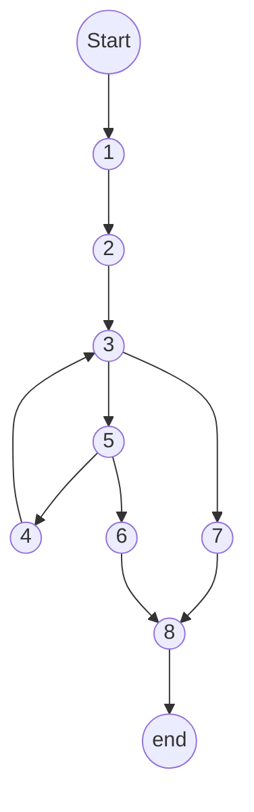
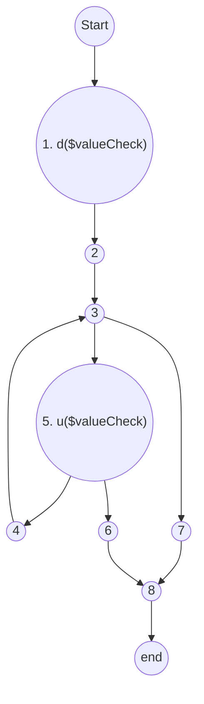
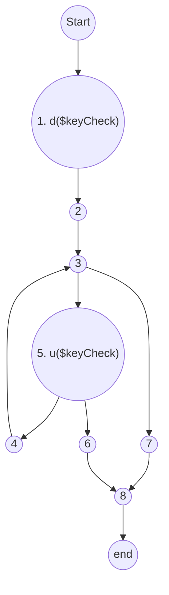
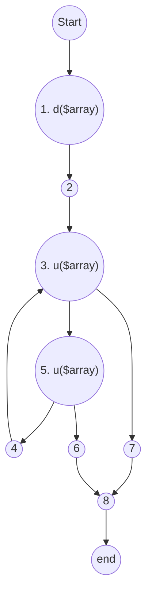
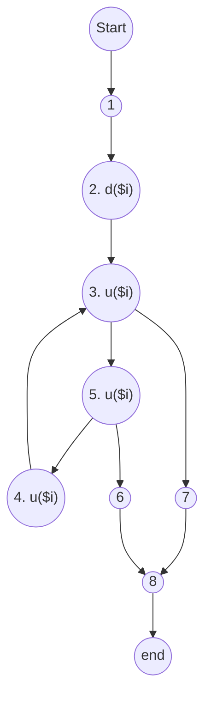

<ul>
<li>
<ul>
<li><a href="#xét-biến-valuecheck">Xét biến $valueCheck</a></li>
<li><a href="#xét-biến-keycheck">Xét biến $keyCheck</a></li>
<li><a href="#xét-biến-array">Xét biến $array</a></li>
<li><a href="#xét-biến-i">Xét biến $i</a></li>
</ul>
</li>
</ul>


> namespace App\\Http\\Services; 

```php

1. function isSameValueArrayAtKey($valueCheck, $keyCheck, $array){ 
2. for ($i=0 ; 
3. $i< count($array);
4. $i++){
5. if (arrayKeys($array)[$i]==$keyCheck && $array[$i] == $valueCheck) {
6.                return true; } 
}

7.   return false;

8.    }

```

Có 3 biến đầu vào (tham số $valueCheck,  $keyCheck, $array) và 1 biến cục bộ $key, $value.
1. Vẽ đồ thị luồng điều khiển.  





  
2. Tính độ phức tạp Cyclomatic của đồ thị.  
  V(G) 
  = e - n + 2\*P
  = 7-6+2 * 1 
  = 3
3. Xác định tập các đường cơ sở.  
1->2->3->5->4->3->5->6->8
1->2->3->5->6->8
1->2->7->8  
4. Cần bao nhiêu test để 100% bao phủ câu lệnh  
(Statement coverage - SC). Xác định các đường dẫn tương ứng.  
Các đường dẫn: 
1->2->3->5->4->3->5->6->8
1->2->7->8
Cần 2 testcase để 100% bao phủ câu lệnh :

Testcase 1 : $array=\["test" => 123 \, "test2"=>"456"] , $keycheck="test2", $valueCheck= "456"
Testcase 2 : $array=\[ \] , $keycheck="test", $valueCheck= "123"

5. Cần bao nhiêu test đối với 100% bao phủ bao phủ nhánh  (Branch coverage - BC). Xác định các đường dẫn tương ứng.  

1->2->3->5->4->3->5->6->8
1->2->7->8
Cần 2 testcase để 100% bao phủ nhánh  :
Testcase 1 : $array=\["test" => 123 \, "test2"=>"456"] , $keycheck="test2", $valueCheck= "456"
Testcase 2 : $array=\[ \] , $keycheck="test", $valueCheck= "123"


6. Cần bao nhiêu test đối với 100% bao phủ bao phủ quyết định  
(Decision coverage - DC). Xác định các đường dẫn tương ứng  
1->2->3->5->4->3->5->6->8
1->2->7->8
Cần 2 testcase để 100% bao phủ quyết định  :
Testcase 1 : $array=\["test" => 123 \, "test2"=>"456"] , $keycheck="test2", $valueCheck= "456"
Testcase 2 : $array=\[ \] , $keycheck="test", $valueCheck= "123"

7. Áp dụng luồng dữ liệu trạng thái  để xác định các bất thường của các biến.  
  $valueCheck, $keyCheck, $array , $i
  


## Xét biến $valueCheck



P1:~duuk
P2:~duk
P3:~**dk**
Chứa cặp đôi bất thường
⇒ Có bất thường
## Xét biến $keyCheck



P1:~duuk
P2:~duk
P3:~**dk**
Chứa cặp đôi bất thường
⇒ Có bất thường
## Xét biến $array


P1:~duuuuk
P2:~duuk
P3:~duk
Cả 3 đường trên đều không chứa cặp đôi nào bất thường. 
⇒ Không có bất thường
## Xét biến $i



P1:~duuuuuuk
P2:~duk
P3:~**dk**
Chứa cặp đôi bất thường
⇒ Có bất thường


8. Xác định def,c-use, p-use của các biến trong chương trình 

```

1. function isSameValueArrayAtKey($valueCheck, $keyCheck, $array){ 
2. for ($i=0 ; 
3. $i< count($array);
4. $i++){
5. if (arrayKeys($array)[$i]==$keyCheck && $array[$i] == $valueCheck) {
6.                return true; } 
}

7.   return false;

8.    }

```

Dòng 1:

- def của $valueCheck: 1
- def của $keyCheck: 1
- def của $array: 1

Dòng 2:

- def của $i: 2

Dòng 3:
- p-use của $i: 3

Dòng 4 :
- def-use của $i: 4

Dòng 5 :

- c-use $i: 5
- c-use của $array: 5
- p-use của $keyCheck: 3
- p-use của $valueCheck: 3


9. Kiểm thử luồng dữ liệu bằng phủ All defs-coverage,  
All-uses coverage, All- Du- Paths Coverage

