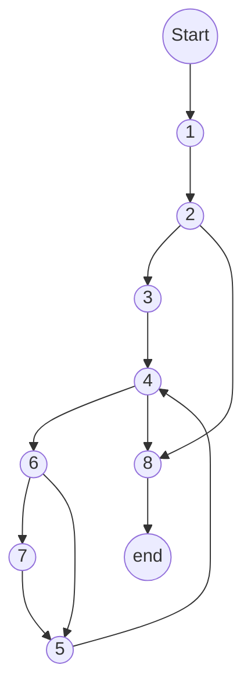
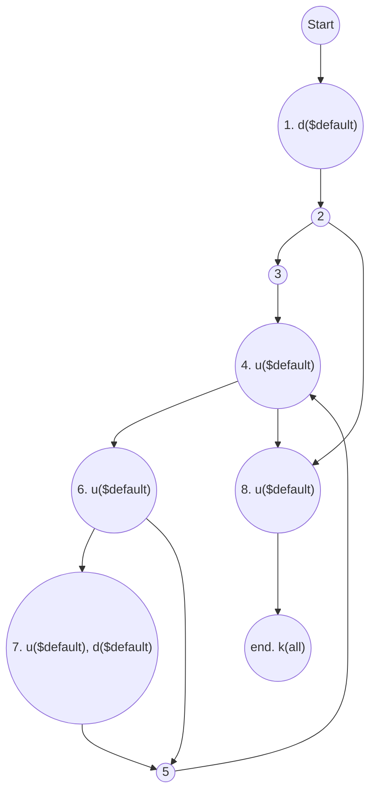
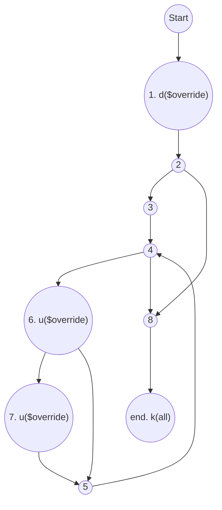
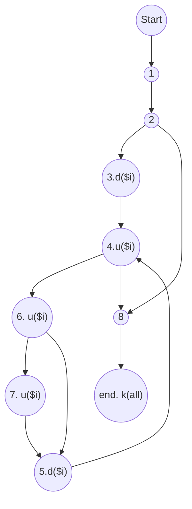

<ul>
<li><a href="#array_override">array_override</a>
<ul>
<li><a href="#xét-biến-default">xét biến $default</a></li>
<li><a href="#xét-biến-override">Xét biến $override</a></li>
<li><a href="#xét-biến-i">Xét biến $i</a></li>
</ul>
</li>
<li><a href="#kiểm-thử-luồng-dữ-liệu-bằng-phủ-all-defs-coverage--all-uses-coverage-all--du--paths-coverage">9. Kiểm thử luồng dữ liệu bằng phủ All defs-coverage,  All-uses coverage, All- Du- Paths Coverage</a>
<ul>
<li><a href="#all-defs-coverage">All defs-coverage</a>
<ul>
<li><a href="#xét-biến-default-1">Xét biến $default</a></li>
<li><a href="#xét-biến-override-1">Xét biến $override</a></li>
<li><a href="#xét-biến-i-1">Xét biến $i</a></li>
</ul>
</li>
<li><a href="#all-uses-coverage">All-uses coverage</a>
<ul>
<li><a href="#xét-biến-default-2">Xét biến $default</a></li>
<li><a href="#xét-biến-override-2">Xét biến $override</a></li>
<li><a href="#xét-biến-i-2">Xét biến $i</a></li>
</ul>
</li>
<li><a href="#all-du-paths-coverage">All-Du-Paths Coverage</a>
<ul>
<li><a href="#xét-biến-default-3">Xét biến $default</a></li>
<li><a href="#xét-biến-override-3">Xét biến $override</a></li>
<li><a href="#xét-biến-i-3">Xét biến $i</a></li>
</ul>
</li>
</ul>
</li>
</ul>


# array_override

```php
 1.   public static function array_override( $default, $override ) {

 2.       if(is_array($override)){       	
 3.           for( $i=0; 
 4.                $i<count(array);
 5.                ++$i ){

 6.               if( isset( $override[arrayKeys($default)[$i]] ) ) 
 
 7.               $default[arrayKeys($default)[$i]] =  $override[arrayKeys($default)[$i]];
            }

        }
 8.       return $default;

    }
```

1. Vẽ đồ thị luồng điều khiển.  



2. Tính độ phức tạp Cyclomatic của đồ thị.  

V(G) 
= e - n + 2\*P
= 11 - 8+2 \* 1 
= 4

3. Xác định tập các đường cơ sở. 
 
- 1->2 -> 8
- 1->2->3 -> 4->8
- 1->2->3->4->6->7->5->4->8
- 1->2->3->4->6->5->4->8
  
4. Cần bao nhiêu test để 100% bao phủ câu lệnh  
-- chưa
(Statement coverage - SC). Xác định các đường dẫn tương ứng.  
Cần 1 testcase:


các đường dẫn tương ứng
- 1->2->3->4->6->7->5->4->6->5->4->8
Testcase 1:
$default = ["title"=>"caphe"]
$override =["title"=>"override"] 

5. Cần bao nhiêu test đối với 100% bao phủ bao phủ nhánh  
(Branch coverage - BC). Xác định các đường dẫn tương ứng.  

các đường dẫn tương ứng
- 1->2->3->4->6->7->5->4->6->5->4->8
- 1->2->8
Testcase 1:
$default = ["title"=>"caphe"]
$override =["title"=>"override"] 
Testcase 2:
$default = ["title"=>"caphe"]
$override = "not array"

6. Cần bao nhiêu test đối với 100% bao phủ bao phủ quyết định  
(Decision coverage - DC). Xác định các đường dẫn tương ứng  
các đường dẫn tương ứng
- 1->2->3->4->6->7->5->4->6->5->4->8
- 1->2->8
Testcase 1:
$default = ["title"=>"caphe"]
$override =["title"=>"override"] 
Testcase 2:
$default = ["title"=>"caphe"]
$override = "not array"
  
7. Áp dụng luồng dữ liệu trạng thái  để xác định các bất thường của  
các biến.  
## xét biến $default


P1: ~duk
P2: ~duuk
P3: ~duuuduuk
P4: ~duuuuk
Cả 3 đường trên đều không chứa cặp đôi nào bất thường. 
⇒ Không có bất thường
## Xét biến $override


## Xét biến $i



8. Xác định def,c-use, p-use của các biến trong chương trình 


  
# 9. Kiểm thử luồng dữ liệu bằng phủ All defs-coverage,  All-uses coverage, All- Du- Paths Coverage

## All defs-coverage

### Xét biến $default
- Tập def của $default: {1,7}
- Tập use của $default: {4,6,7,8}
- Từ đỉnh 1 đến đỉnh 4 tồn tại cặp def-use (1,4)
- Path: [1,2,3,4]

### Xét biến $override
- Tập def của $override: {1}
- Tập use của $override: {6,7}
- Từ đỉnh 1 đến đỉnh 6 tồn tại cặp def-use (1,6)
- Path: [1,2,3,4,6]

### Xét biến $i
- Tập def của $i: {3,5}
- Tập use của $i: {4,6,7}
- Từ đỉnh 3 đến đỉnh 4 tồn tại cặp def-use (3,4)
- Path: [3,4]

⇒ Thoả điều kiện All-defs-coverage

## All-uses coverage

### Xét biến $default
- Từ d1($ default) đến u4($ default)
- Từ d1($ default) đến u6($ default)
- Từ d1($ default) đến u7($ default)
- Từ d1($ default) đến u8($ default)
- Từ d7($ default) đến u4($ default)
- Từ d7($ default) đến u6($ default)
- Từ d7($ default) đến u8($ default)
Cặp def use và def clear path của biến này:
- (1,4): [1,2,3,4]
- (1,6): [1,2,3,4,6]
- (1,7): [1,2,3,4,6,7]
- (1,8): [1,2,3,4,6,7,5,4,8]
- (7,4): [7,5,4]
- (7,6): [7,5,4,6]
- (7,8): [7,5,4,8]

### Xét biến $override
- Từ d1($ override) đến u6($ override)
- Từ d1($ override) đến u7($ override)
Cặp def use và def clear path của biến này:
- (1,6): [1,2,3,4,6]
- (1,7): [1,2,3,4,6,7]
### Xét biến $i
- Từ d3($ override) đến u4($ override)
- Từ d3($ override) đến u6($ override)
- Từ d3($ override) đến u7($ override)
- Từ d5($ override) đến u4($ override)
- Từ d5($ override) đến u6($ override)
- Từ d5($ override) đến u7($ override)
Cặp def use và def clear path của biến này:
- (3,4): [3,4]
- (3,6): [3,4,6]
- (3,7): [3,4,6,7]
- (5,4): [5,4]
- (5,6): [5,4,6]
- (5,7): [5,4,6,7]

⇒ Thoả điều kiện All-uses coverage

## All-Du-Paths Coverage

### Xét biến $default
- Tất cả d1($ default) đến u4($ default): [1,2,3,4]
- Tất cả d1($ default) đến u6($ default): [1,2,3,4,6]
- Tất cả d1($ default) đến u7($ default): [1,2,3,4,6,7]
- Tất cả d1($ default) đến u8($ default): [1,2,3,4,6,7,5,4,8]
- Tất cả d7($ default) đến u4($ default): [7,5,4]
- Tất cả d7($ default) đến u6($ default): [7,5,4,6]
- Tất cả d7($ default) đến u8($ default): [7,5,4,8]
Các đường dẫn thoả yêu cầu:
- [1,2,3,4,8]
- [1,2,3,4,6,5,4,8]
- [1,2,3,4,6,7,5,4,8]
- [1,2,3,4,6,7,5,4,6,5,4,8]
- [1,2,3,4,6,7,5,4,6,7,5,4,8]

### Xét biến $override
- Tất cả d1($ override) đến u6($ override): [1,2,3,4,6]
- Tất cả d1($ override) đến u7($ override): [1,2,3,4,6,7]
Các đường dẫn thoả yêu cầu:
- [1,2,3,4,6,5,4,8]
- [1,2,3,4,6,7,5,4,8]

### Xét biến $i
- Tất cả d3($ override) đến u4($ override): [3,4]
- Tất cả d3($ override) đến u6($ override): [3,4,6]
- Tất cả d3($ override) đến u7($ override): [3,4,6,7]
- Tất cả d5($ override) đến u4($ override): [5,4]
- Tất cả d5($ override) đến u6($ override): [5,4,6]
- Tất cả d5($ override) đến u7($ override): [5,4,6,7]
Các đường dẫn thoả yêu cầu:
- [1,2,3,4,8]
- [1,2,3,4.6,5,4,8]
- [1,2,3,4,6,7,5,4,8]
- [1,2,3,4,6,7,5,4,6,5,4,8]
- [1,2,3,4,6,7,5,4,6,7,5,4,8]

⇒ Thoả điều kiện All-Du-Paths Coverage

