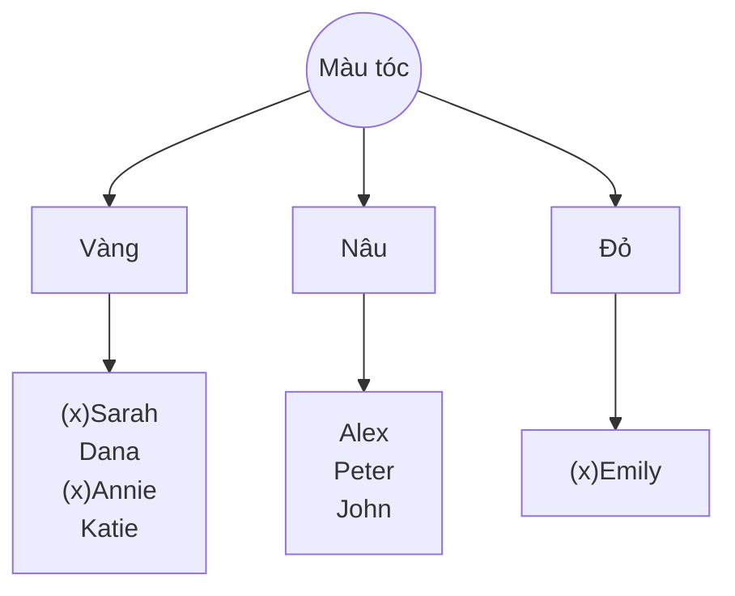

<ul>
<li><a href="#thuật-toán-id3-quinlan">Thuật toán ID3 (Quinlan)</a></li>
</ul>

# Thuật toán ID3 (Quinlan)

Entropy = 4/8[-2/4*log2(2/4) -2/4*log2(2/4)] + 3/8[-3/3*log2(3/3)] + 1/8[-1/1*log2(1/1)]

